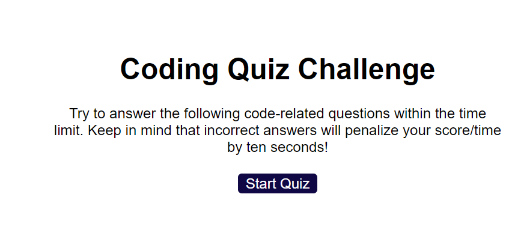
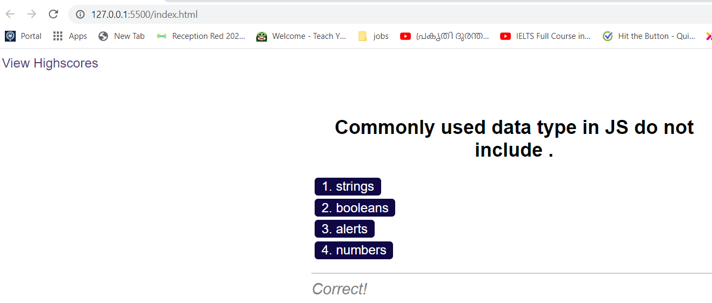
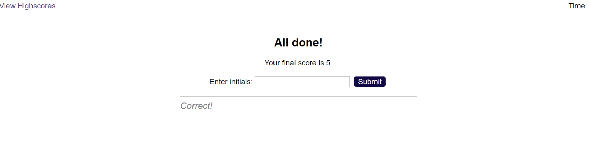
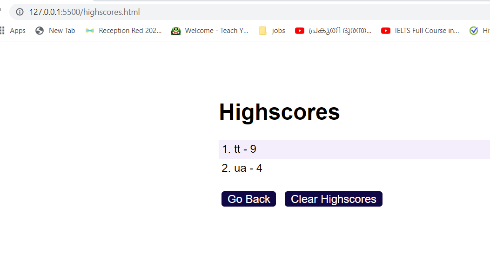

# Module 6 Challenge Web APIs: Code Quiz

 

## User Story

```
AS A coding boot camp student
I WANT to take a timed quiz on JavaScript fundamentals that stores high scores
SO THAT I can gauge my progress compared to my peers
```

##  

Created a quiz application that contains the following:

* A start button to start the quiz which will also triger a timer. 
 
  * Each Questions has four options and user can select one of them.
 
  * When answer is clicked, the next question appears
 
  * The quiz ends when all questions are answered or the timer reaches 0.

  * When the game ends, it displays their score and give the user the ability to save their initials and their score
  * It is also displays the highest score so that the user can compare the score with the highest score. 
  

### Screenshots

<b>The home page of code quiz</b>  
<br>  


<br>   

<br>  

<b>After answering a question Screenshot</b>  

<br>  

<br>  

<b>After answering all questions/the timer reaches 0 Screenshot</b>

<br>  

<br>  

<b>After answering all questions and entering initials showing highscore Screenshot</b>

<br>


© 2022 edX Boot Camps LLC. Confidential and Proprietary. All Rights Reserved.